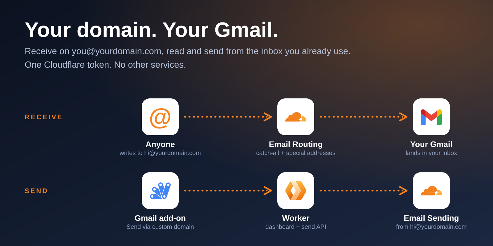

<p align="center">
  
</p>

<h1 align="center">gmail-cloudflare</h1>

<p align="center">
  Use a professional address on your own domain, without leaving the Gmail you already live in.<br>
  <a href="SETUP.md"><strong>Setup guide</strong></a> · <a href="#how-it-works">How it works</a> · <a href="#limits">Limits</a>
</p>

---

## The problem

You use `abcd@gmail.com` every day, but you want `hello@yourdomain.com` on invoices, signups and cold emails. The usual answers are a paid Google Workspace seat, a second inbox to check, or a pile of DNS and SMTP settings.

## How it helps

| You get | Instead of |
| --- | --- |
| **One inbox.** Everything sent to your domain lands in your normal Gmail. | Checking a second mailbox, or paying per seat for Workspace. |
| **Catch-all plus special addresses.** `anything@` works, and `billing@` can go to a different inbox. | Creating a mailbox for every alias. |
| **Send as your domain from Gmail.** A "Send via custom domain" action in compose. | Juggling "Send mail as" and SMTP credentials. |
| **One Cloudflare token.** Receiving and sending both run on Cloudflare. | Signing up for a separate email-sending service. |
| **A small dashboard.** Add inboxes, toggle the catch-all, add and remove addresses. | Clicking through several Cloudflare screens. |

## How it works

```
Receive:  sender -> hi@yourdomain.com -> Cloudflare Email Routing -> your Gmail
Send:     Gmail add-on -> Worker /api/send -> Cloudflare Email Sending -> recipient
```

| Part | What it does |
| --- | --- |
| Cloudflare Email Routing | Forwards mail for your domain to the inboxes you choose |
| Dashboard (`public/`) | Inboxes, domain, catch-all and special addresses in one screen |
| Worker (`src/index.js`) | Serves the dashboard, proxies the Cloudflare API, sends mail |
| Gmail Add-on (`addon/`) | Compose action plus a side panel to write or reply from your domain address |

### The dashboard

1. **Inboxes you forward to** - add real inboxes (verified once by email), remove them later.
2. **Domain** - pick a zone and enable Email Routing.
3. **Catch-all** - on or off, with a dropdown for which verified inbox gets everything else.
4. **Special addresses** - e.g. `billing@`, each forwarded to the inbox you pick. They win over the catch-all.

## Quick start

About 15 minutes. Full walkthrough in [SETUP.md](SETUP.md).

```
npm install
npx wrangler secret put CF_API_TOKEN
npx wrangler secret put ADMIN_PASSWORD
npx wrangler deploy
npm run addon:setup   # creates and pushes the Gmail add-on via clasp
```

Then open the Worker URL, add your Gmail, enable routing, and install the add-on (Deploy > Test deployments > Install).

## Limits

- Add-ons cannot read the live compose box, so the compose action sends the most recent auto-saved draft. Wait a few seconds after typing.
- An add-on cannot place a button next to Gmail's own Send. The action lives in the compose window's add-on menu.
- Replies sent this way are not threaded in the recipient's client (no In-Reply-To header yet).
- Email Routing needs the domain's DNS on Cloudflare and replaces existing MX records.
- Email Sending is a newer Cloudflare product. Check what your plan allows.
- The Worker uses one shared password. For stricter access, put it behind Cloudflare Access.
- Alternative with no code: Gmail's Settings > Accounts > "Send mail as" with any SMTP provider.

## Credits

Icons from [theSVG](https://thesvg.org) (MIT), used through the `thesvg` npm package. Gmail, Cloudflare and Google Apps Script logos are trademarks of their owners. Regenerate the hero image with `npm run hero`.
